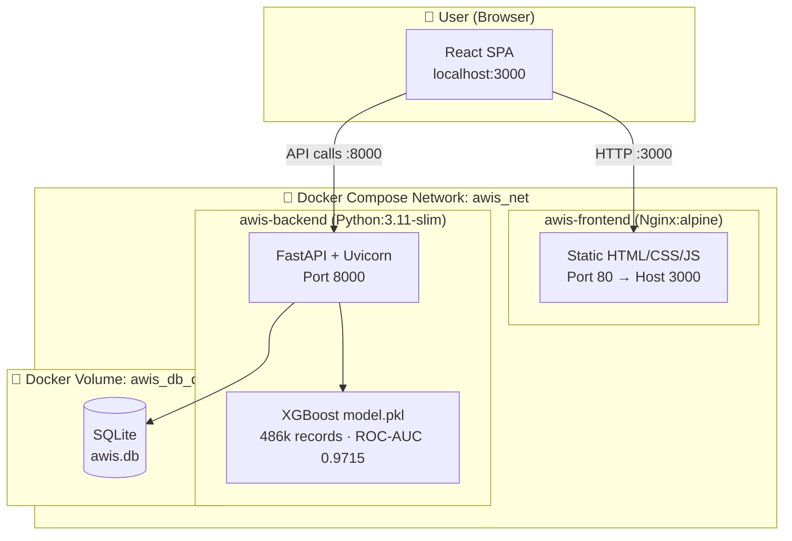

<div align="center">

# 🏛️ AWIS — Adaptive Workflow Intervention System

**An AI-powered permit application risk assessment platform.**  
Predicts the probability of rejection for government permit applications using a tuned XGBoost model trained on 486,090 historical records, with a full-stack admin dashboard.

[](https://python.org)
[](https://fastapi.tiangolo.com)
[](https://react.dev)
[](https://xgboost.readthedocs.io)
[](https://docs.docker.com/compose/)
[](LICENSE)

</div>

---

## 📋 Table of Contents

- [Overview](#-overview)
- [Features](#-features)
- [Architecture](#-architecture)
- [Folder Structure](#-folder-structure)
- [Technology Stack](#-technology-stack)
- [Quick Start with Docker](#-quick-start-with-docker)
- [Manual Setup (No Docker)](#-manual-setup-no-docker)
- [Environment Variables](#-environment-variables)
- [API Reference](#-api-reference)
- [Database Schema](#-database-schema)
- [ML Model](#-ml-model)
- [Screenshots](#-screenshots)
- [Troubleshooting](#-troubleshooting)
- [Reproducing the Model](#-reproducing-the-model)
- [Future Improvements](#-future-improvements)
- [Contributing](#-contributing)
- [License](#-license)

---

## 🔍 Overview

AWIS (Adaptive Workflow Intervention System) is a full-stack AI application designed for government and municipal permit processing agencies. It analyses permit applications in real time and predicts their likelihood of rejection using an XGBoost gradient-boosting model, enabling officers to flag high-risk applications before they enter the manual review queue.

The system includes:
- A **REST API** (FastAPI) exposing prediction, submission, rules, and analytics endpoints
- A **React admin dashboard** with a submissions queue, analytics charts, and a live rules editor
- An **XGBoost ML model** achieving **ROC-AUC 0.9715** on 486k historical applications
- A **SQLite database** for audit-safe persistence of all submissions, rules, and change history

---

## ✨ Features

| Feature | Description |
|---|---|
| 🤖 **AI Risk Scoring** | Per-application rejection probability (0–100) from a tuned XGBoost model |
| 🔍 **SHAP Explainability** | Top 5 feature contributions (SHAP values) for every prediction |
| 📋 **Submission Queue** | Sortable, paginated list of all scored applications |
| 📊 **Analytics Dashboard** | Zone-level rejection rates, top risk drivers, monthly trend charts |
| ⚙️ **Rules Editor** | Full CRUD interface for admin-managed rejection rules with audit trail |
| 🗄️ **Audit Log** | Immutable change history for all submissions and rule modifications |
| 🐳 **Docker Ready** | One-command startup with `docker compose up --build` |
| 🔌 **REST API** | Swagger UI (`/docs`) and ReDoc (`/redoc`) auto-generated documentation |

---

## 🏗️ Architecture



### Request Flow

```
Browser → GET /                    → Nginx serves React SPA
Browser → GET /submissions         → FastAPI → SQLAlchemy → SQLite
Browser → POST /predict            → FastAPI → XGBoost model → SHAP → SQLite → JSON
Browser → GET /analytics           → FastAPI → aggregate from SQLite → JSON
Browser → GET|POST|PUT|DELETE /rules → FastAPI → Rules CRUD + Audit log
```

---

## 📁 Folder Structure

```
AWIS/
├── 📄 main.py                  # FastAPI app — all API endpoints
├── 📄 database.py              # SQLAlchemy models & DB session factory
├── 📄 train_model.py           # XGBoost training pipeline (run once offline)
├── 📄 model.pkl                # Pre-trained XGBoost model (585 KB)
├── 📄 feature_importance.json  # Feature gain scores (used by /features endpoint)
├── 📄 requirements.txt         # Python dependencies
├── 📄 Dockerfile.backend       # Multi-stage Docker image for FastAPI
├── 📄 docker-compose.yml       # Orchestrates backend + frontend + volume
├── 📄 nginx.conf               # Nginx config for React SPA
├── 📄 .dockerignore            # Excludes large files from Docker build context
├── 📄 .gitignore               # Git exclusion rules
├── 📄 .env.example             # Template for environment variables
├── 📄 LICENSE                  # MIT License
├── 📄 start_backend.bat/.sh    # Quick-start scripts for local dev (no Docker)
├── 📄 start_frontend.bat/.sh   # Quick-start scripts for local dev (no Docker)
│
├── 📊 confusion_matrix.png     # Model evaluation chart
├── 📊 feature_importance.png   # Feature importance bar chart
│
└── frontend/                   # React + Vite frontend
    ├── 📄 Dockerfile           # Multi-stage Docker image for React/Nginx
    ├── 📄 package.json         # Node dependencies
    ├── 📄 vite.config.js       # Vite bundler configuration
    ├── 📄 index.html           # HTML entry point
    └── src/
        ├── 📄 main.jsx         # React entry point
        ├── 📄 App.jsx          # Root component + tab navigation
        ├── config/
        │   └── 📄 api.js       # Centralised API base URL (reads VITE_API_URL)
        ├── pages/
        │   ├── 📄 Queue.jsx        # Submission queue page
        │   ├── 📄 Analytics.jsx    # Analytics & charts page
        │   └── 📄 RulesEditor.jsx  # Rules CRUD page
        └── components/
            ├── 📄 RuleCard.jsx     # Individual rule display card
            └── 📄 RuleForm.jsx     # Create / edit rule form
```

---

## 🛠️ Technology Stack

| Layer | Technology | Version |
|---|---|---|
| **Backend Framework** | FastAPI | 0.136 |
| **ASGI Server** | Uvicorn (standard) | 0.46 |
| **ML Model** | XGBoost | 3.2 |
| **Data Processing** | Pandas | 3.0 |
| **Numerics** | NumPy | 2.4 |
| **ORM** | SQLAlchemy | 2.0 |
| **Data Validation** | Pydantic v2 | 2.13 |
| **Database** | SQLite | bundled |
| **Frontend Framework** | React | 19 |
| **Build Tool** | Vite | 8 |
| **HTTP Client** | Axios | 1.16 |
| **Charts** | Recharts | 3.8 |
| **Web Server** | Nginx (alpine) | 1.27 |
| **Containerisation** | Docker Compose | v2 |
| **Language (Backend)** | Python | 3.11 |
| **Language (Frontend)** | JavaScript (ES2022) | — |

---

## 🐳 Quick Start with Docker

### Prerequisites

- [Docker Desktop](https://www.docker.com/products/docker-desktop/) (includes Docker Compose)
- Ports **8000** and **3000** must be free on your machine

### Start

```bash
# Clone the repository
git clone https://github.com/YOUR_USERNAME/AWIS.git
cd AWIS

# Build images and start all services
docker compose up --build
```

> ⏳ First build takes 3–5 minutes (downloads Python/Node/Nginx base images and installs all dependencies). Subsequent builds use the layer cache and complete in ~30 seconds.

### Access

| Service | URL |
|---|---|
| **React Dashboard** | http://localhost:3000 |
| **FastAPI Backend** | http://localhost:8000 |
| **Swagger UI (interactive docs)** | http://localhost:8000/docs |
| **ReDoc** | http://localhost:8000/redoc |
| **Health check** | http://localhost:8000/health |

### Stop

```bash
docker compose down          # stop — data volume is preserved
docker compose down -v       # stop + delete database (WARNING: data loss)
```

### Other Useful Commands

```bash
docker compose logs -f              # stream logs from all containers
docker compose logs -f backend      # backend logs only
docker compose up --build backend   # rebuild backend only
docker compose ps                   # check container status
docker exec -it awis-backend sh     # shell into backend container
```

---

## 🖥️ Manual Setup (No Docker)

### Prerequisites

- Python **3.10+**
- Node.js **18+** and npm
- Git

### 1. Clone

```bash
git clone https://github.com/YOUR_USERNAME/AWIS.git
cd AWIS
```

### 2. Backend

**Windows:**
```bat
start_backend.bat
```

**macOS / Linux:**
```bash
chmod +x start_backend.sh
./start_backend.sh
```

Or manually:
```bash
python -m venv .venv
# Windows:  .venv\Scripts\activate
# Mac/Linux: source .venv/bin/activate

pip install -r requirements.txt
uvicorn main:app --host 0.0.0.0 --port 8000 --reload
```

### 3. Frontend (new terminal)

**Windows:**
```bat
start_frontend.bat
```

**macOS / Linux:**
```bash
chmod +x start_frontend.sh
./start_frontend.sh
```

Or manually:
```bash
cd frontend
npm install
npm run dev
```

The frontend dev server starts at **http://localhost:5173**.

---

## 🔧 Environment Variables

Copy `.env.example` to `.env` and adjust as needed:

```bash
cp .env.example .env   # Mac/Linux
copy .env.example .env  # Windows
```

| Variable | Default | Description |
|---|---|---|
| `DB_PATH` | `./awis.db` | Full path to the SQLite database file |
| `HOST` | `0.0.0.0` | Uvicorn bind host |
| `PORT` | `8000` | Uvicorn bind port |
| `WORKERS` | `1` | Number of Uvicorn worker processes |
| `VITE_API_URL` | `http://localhost:8000` | Backend URL baked into the React bundle at build time |

> **Note:** `VITE_API_URL` is a **Vite build-time variable** (prefixed with `VITE_`). It is compiled into the JavaScript bundle and cannot be changed at runtime without rebuilding the frontend.

---

## 📡 API Reference

Base URL: `http://localhost:8000`

### Core Endpoints

| Method | Endpoint | Description |
|---|---|---|
| `GET` | `/` | API overview and available endpoints |
| `GET` | `/health` | Liveness / readiness check |
| `GET` | `/schema` | Full JSON schema for POST /predict |
| `GET` | `/features` | Feature list and top-10 importance scores |

### Prediction

| Method | Endpoint | Description |
|---|---|---|
| `POST` | `/predict` | Score an application; returns risk score + SHAP features |
| `POST` | `/submit` | Score + persist to database; returns saved record |

#### Example — `POST /predict`

```bash
curl -X POST http://localhost:8000/predict \
  -H "Content-Type: application/json" \
  -d '{
    "source_enc": 1,
    "permit_type_enc": 3,
    "zone_enc": 2,
    "city_enc": 1,
    "area_sqm": 850.0,
    "construction_cost": 12500.0,
    "doc_count": 4,
    "missing_doc_count": 2,
    "has_title_deed": 1,
    "has_site_plan": 0,
    "has_noc_fire": 0,
    "has_noc_env": 0,
    "has_struct_cert": 0,
    "has_crz_cert": 0,
    "pan_valid": 1,
    "zone_type_conflict": 1,
    "area_exceeds_fsi": 1,
    "year": 2024,
    "month": 6
  }'
```

#### Example Response

```json
{
  "rejection_risk_score": 78.43,
  "rejection_probability": 0.784302,
  "confidence": 0.784302,
  "prediction": "Rejected",
  "top_contributing_features": [
    { "feature": "zone_type_conflict", "shap_value": 0.812341, "impact": "increases_risk" },
    { "feature": "missing_doc_count",  "shap_value": 0.634210, "impact": "increases_risk" },
    { "feature": "area_exceeds_fsi",   "shap_value": 0.511234, "impact": "increases_risk" },
    { "feature": "has_site_plan",      "shap_value": -0.22341, "impact": "decreases_risk" },
    { "feature": "permit_type_enc",    "shap_value": 0.198734, "impact": "increases_risk" }
  ]
}
```

### Submissions

| Method | Endpoint | Description |
|---|---|---|
| `GET` | `/submissions` | List all submissions (sorted by risk score desc) |
| `GET` | `/submissions/{id}` | Get single submission by ID |

Query params for `/submissions`: `limit` (default 50, max 500), `offset` (default 0)

### Rules

| Method | Endpoint | Description |
|---|---|---|
| `GET` | `/rules` | List all rules (`?active_only=true` to filter) |
| `GET` | `/rules/{id}` | Get a single rule |
| `POST` | `/rules` | Create a new rule |
| `PUT` | `/rules/{id}` | Partially update a rule |
| `DELETE` | `/rules/{id}` | Soft-delete a rule (`?hard=true` for permanent) |

### Analytics

| Method | Endpoint | Description |
|---|---|---|
| `GET` | `/analytics` | Aggregated stats: zone rates, top reasons, time series |

### Input Field Reference

| Field | Type | Range | Description |
|---|---|---|---|
| `source_enc` | int | 0–3 | 0=Online, 1=District, 2=Municipal, 3=State |
| `permit_type_enc` | int | 0–5 | 0=Residential … 5=Agricultural |
| `zone_enc` | int | 0–5 | 0=Residential … 5=Special/Eco |
| `city_enc` | int | 0–7 | 0=Mumbai … 7=Ahmedabad |
| `area_sqm` | float | ≥0 | Plot area in square metres |
| `construction_cost` | float | ≥0 | Estimated cost |
| `doc_count` | int | ≥0 | Total documents submitted |
| `missing_doc_count` | int | ≥0 | Documents missing or incomplete |
| `has_title_deed` | int | 0/1 | Title deed present |
| `has_site_plan` | int | 0/1 | Site plan present |
| `has_noc_fire` | int | 0/1 | Fire NOC obtained |
| `has_noc_env` | int | 0/1 | Environmental NOC obtained |
| `has_struct_cert` | int | 0/1 | Structural certificate present |
| `has_crz_cert` | int | 0/1 | CRZ certificate present |
| `pan_valid` | int | 0/1 | PAN number valid |
| `zone_type_conflict` | int | 0/1 | Zone–permit type conflict detected |
| `area_exceeds_fsi` | int | 0/1 | Plot area exceeds FSI limit |
| `year` | int | 1990–2100 | Year of application |
| `month` | int | 1–12 | Month of application |

---

## 🗄️ Database Schema

SQLite database at `./awis.db` (Docker: persisted in `awis_db_data` volume).

```
submissions
├── id           INTEGER  PK, autoincrement
├── form_data    TEXT     JSON — raw input fields (19 user-supplied features)
├── risk_score   REAL     Rejection probability × 100 (0–100)
├── top_reasons  TEXT     JSON — top 5 SHAP-contributing features
├── submitted_at DATETIME UTC timestamp
├── source       TEXT     Human-readable source label
├── city         TEXT     Human-readable city label
├── permit_type  TEXT     Human-readable permit type label
└── zone         TEXT     Human-readable zone label

rules
├── id           INTEGER  PK, autoincrement
├── rule_name    TEXT     Unique, human-readable name
├── rule_type    TEXT     threshold | flag_check | document_check | zone_permit_mismatch
├── zone         TEXT     Zone filter (NULL = all zones)
├── permit_type  TEXT     Permit type filter (NULL = all types)
├── condition    TEXT     Operator: >, ==, match, missing …
├── value        TEXT     Threshold or comparison value
├── active       BOOLEAN  Soft-delete flag
├── created_at   DATETIME UTC
└── updated_at   DATETIME UTC

audit_log
├── id            INTEGER  PK, autoincrement
├── submission_id INTEGER  FK → submissions.id (nullable)
├── event_type    TEXT     submission_created | rule_created | rule_updated | …
├── old_value     TEXT     Serialised previous state (JSON)
├── new_value     TEXT     Serialised new state (JSON)
├── changed_by    TEXT     Actor identifier (api | admin | system)
└── changed_at    DATETIME UTC
```

---

## 🤖 ML Model

### Model Details

| Property | Value |
|---|---|
| Algorithm | XGBoost (gradient-boosted decision trees) |
| Training data | 486,090 historical permit applications |
| Features | 20 (19 user-supplied + 1 server-computed `risk_tier`) |
| ROC-AUC | **0.9715** |
| Accuracy | ~95% |
| Tuning method | RandomizedSearchCV (25 iterations, stratified 20% sample) |
| Early stopping | Yes — val-AUC, 30 rounds patience |
| Threshold | 50% probability → "Rejected" |
| File | `model.pkl` (585 KB) |

### Top Features by Gain

1. `risk_score` (server-computed risk tier)
2. `missing_doc_count`
3. `zone_type_conflict`
4. `area_exceeds_fsi`
5. `has_title_deed`

### SHAP Explainability

Every `/predict` call computes per-sample SHAP values using XGBoost's built-in `pred_contribs=True`. This requires no additional library (no `shap` package needed) and returns the top 5 feature contributions along with their direction (increases / decreases risk).

---

## 📸 Screenshots

> *Add screenshots by placing images in the repository and updating the paths below.*

### Submission Queue


### Analytics Dashboard


### Rules Editor


### Swagger API Docs


---

## 🔧 Troubleshooting

### Backend fails to start — `model.pkl not found`

The trained model file must exist before starting. If you deleted it or cloned without it:
```bash
# Install training dependencies first
pip install scikit-learn matplotlib seaborn
# Run the training pipeline (requires ml_features.csv — not included in repo due to 26MB size)
python train_model.py
```
If you don't have `ml_features.csv`, contact the maintainer for access to the dataset.

### Frontend shows "Could not load submissions"

The backend may still be initialising. Wait 15–20 seconds after `docker compose up --build` and refresh. Check backend logs:
```bash
docker compose logs -f backend
```

### Port already in use

```bash
# Windows — find what's using port 8000
netstat -ano | findstr :8000
# macOS/Linux
lsof -i :8000
lsof -i :3000
```
Change ports in `docker-compose.yml` (e.g., `"9000:8000"`) if needed.

### CORS errors in browser console

Verify that `VITE_API_URL` matches the actual backend host and port. The backend has `allow_origins=["*"]` so CORS itself is not restricted — the URL just needs to be correct.

### `npm ci --prefer-offline` fails during Docker build

Run `docker compose build --no-cache frontend` to force a fresh npm install.

### Docker build fails on Windows — line ending errors in `.sh` files

Ensure your Git is configured to preserve LF line endings:
```bash
git config --global core.autocrlf false
```

### Database is empty after a Docker rebuild

Data persists in the `awis_db_data` named volume across rebuilds. If empty, you may have run `docker compose down -v` which deletes the volume. Use the mock portal (`mock_portal.html`) or `POST /submit` to populate data.

---

## 🔬 Reproducing the Model

The `model.pkl` file is committed to the repository for convenience. To retrain from scratch:

1. Obtain `ml_features.csv` (486,090 rows — contact maintainer)
2. Place it in the repository root
3. Install training dependencies:
   ```bash
   pip install scikit-learn matplotlib seaborn
   ```
4. Run the training pipeline:
   ```bash
   python train_model.py
   ```
   This generates: `model.pkl`, `feature_importance.json`, `confusion_matrix.png`, `feature_importance.png`, `tuning_results.json`

---

## 🚀 Future Improvements

- [ ] **PostgreSQL** — Replace SQLite with PostgreSQL for production-grade concurrency
- [ ] **Authentication** — Add JWT-based auth to the admin dashboard
- [ ] **Real-time updates** — WebSocket for live submission queue updates
- [ ] **CI/CD pipeline** — GitHub Actions for automated testing and Docker image publishing
- [ ] **Unit tests** — pytest for backend endpoints; Vitest for React components
- [ ] **Rate limiting** — Add API rate limiting to prevent abuse
- [ ] **Multi-model support** — A/B test multiple models per rule set
- [ ] **Export** — CSV/PDF export of submission queue and analytics
- [ ] **Notifications** — Email/webhook alerts for high-risk applications
- [ ] **Kubernetes** — Helm chart for cloud-native deployment

---

## 👩‍💻 Contributing

Contributions are welcome! Please follow these steps:

1. Fork the repository
2. Create a feature branch: `git checkout -b feature/my-feature`
3. Commit your changes: `git commit -m 'feat: add my feature'`
4. Push: `git push origin feature/my-feature`
5. Open a Pull Request

Please keep commits small and focused, and update documentation as needed.

---

## 📄 License

This project is licensed under the **MIT License** — see the [LICENSE](LICENSE) file for details.

---

<div align="center">

**Built with ❤️ as part of the UPES B.Tech Minor Project**

[⬆ Back to top](#-awis--adaptive-workflow-intervention-system)

</div>
